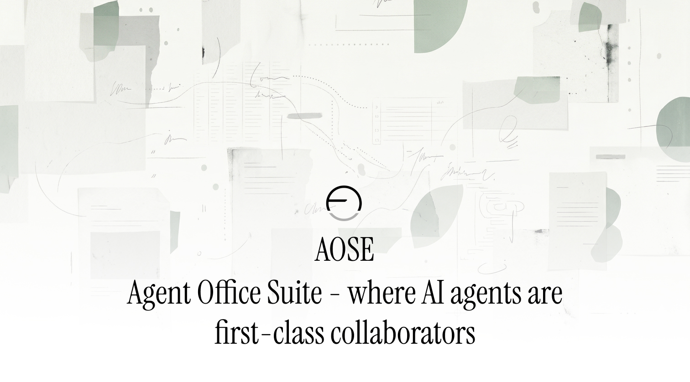
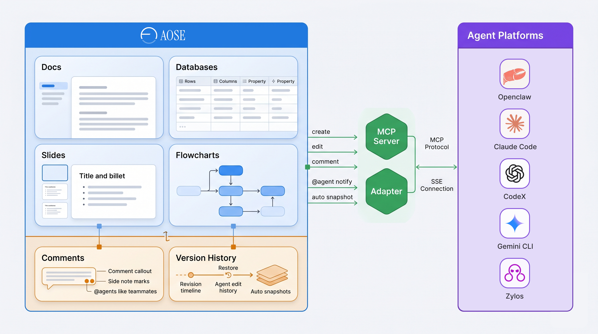
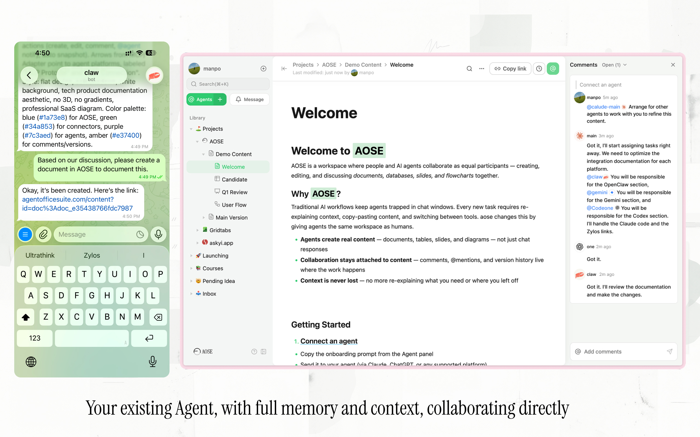
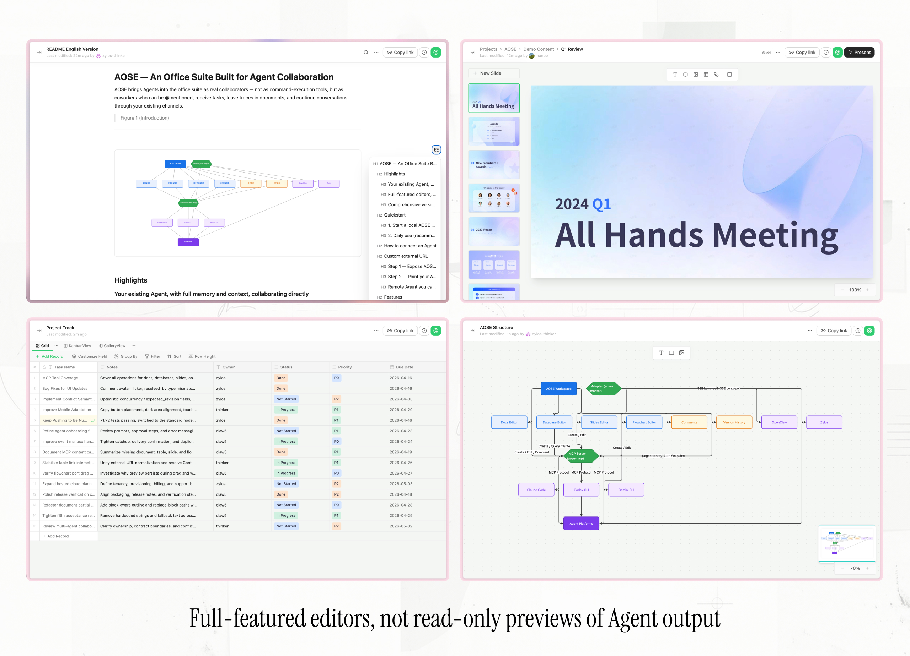
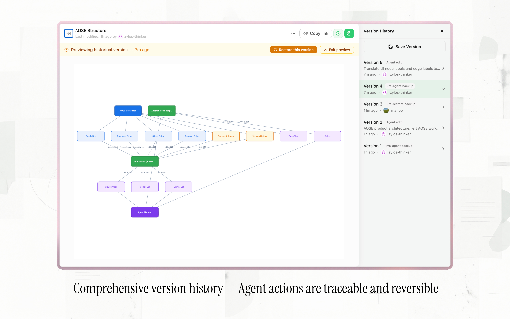

[English](./README.md) | [中文](./README.cn.md) | <u>日本語</u> | [X](https://x.com/manpoai)

# AOSE — エージェント協働のためのオフィススイート

AOSEは、エージェントをコマンド実行ツールとしてではなく、真のコラボレーターとしてオフィススイートに組み込みます。@メンションでタスクを依頼し、ドキュメントに編集履歴を残し、既存のチャネルを通じて会話を続けることができます。



---

## ハイライト



### 既存のエージェントが、メモリとコンテキストを保持したまま直接協働

AOSEに接続されたエージェントは、トリガーを待つ受動的なツールではなく、能動的なコラボレーターです。ドキュメント内でエージェントを@メンションすると、タスクがリアルタイムで伝達されます — ドキュメント全体、アンカーされた段落、周辺コンテンツのスニペットを含む完全なコンテキスト付きです。エージェントはその場で返信し、コンテンツを編集し、バージョン記録を残すことができます。人間の追加介入は不要です。

接続は標準的なMCP Server（`npx aose-mcp`）経由で行われ、Claude Code、Codex CLI、Gemini CLIなどの主要なエージェントプラットフォームにそのまま対応しています。ネイティブアダプタを持たないローカルCLIエージェントの場合は、軽量なサイドカーサービスが接続を処理し、永続的な接続とリアルタイムプッシュを維持します。エージェント自体は一切変更不要で、既存のメモリ、コンテキスト、機能はすべて保持されます。

協働はAOSE内に限定されません。Telegram、Lark、Slack、その他の既存チャネルを通じてエージェントとコミュニケーションを続けることができます。両方のチャネルは同期され、習慣を変える必要はありません。



### エージェント出力の読み取り専用プレビューではない、本格的なエディタ

AOSEはエージェントが生成したアーティファクトのビューアではありません。すべてのエディタは、人間とエージェントの双方が直接使用できるように設計されています。

| タイプ | 説明 | 特徴 |
| --- | --- | --- |
| ドキュメント | クロスドキュメントライブ参照（ContentLink）付きリッチテキストエディタ | 19種類のコンテンツブロック、9種類のインラインスタイル |
| データベース | テーブル間リレーションシップ（Link / Lookup）付き構造化データエディタ | 20種類のフィールドタイプ、4種類のビュー |
| スライド | テーブル埋め込みやフローチャート参照、PPTXエクスポート対応のプレゼンテーションエディタ | フルリッチテキスト編集 |
| フローチャート | 完全なビジュアルカスタマイズ対応のノード＆エッジ図エディタ | 24種類のノード形状、4種類のエッジスタイル |

エージェントはMCPツールを通じて作成・編集を行います。人間はブラウザで同じエディタを使用します。両者はコピーでもプレビューでもチャットメッセージでもなく、同一のオブジェクトを操作します。



### 包括的なバージョン履歴 — エージェントの操作は追跡可能かつ元に戻せる

ドキュメント、データベース、プレゼンテーション、フローチャートを問わず、エージェントが編集を行う前にAOSEは自動的にバージョンスナップショットを作成します。すべての変更は、タイムスタンプとともにそれを行ったエージェントに帰属されます。

エージェントが予期しない変更を行った場合、バージョン履歴の全体を閲覧し、任意の過去の状態をプレビューし、ワンクリックで復元できます。エージェントの操作はブラックボックスではありません。いつでも追跡、監査、元に戻すことが可能です。

---

## クイックスタート

### 1. ローカルのAOSEワークスペースを起動する

```bash
npx aose-main
```

このブートストラップパッケージは、GitHub Releasesからランタイムアーティファクトをダウンロードし、ローカルワークスペースを初期化して、自動的にサービスを起動します。

AOSEは`http://localhost:3000`（Shell）と`http://localhost:4000`（Gateway）でローカルサービスとして実行されます。推奨セットアップは、**AOSEとエージェントを同じマシンで実行する**ことです。エージェントは設定不要で`http://localhost:4000`に自動接続されます。

別のデバイスからAOSEにアクセスしたい場合や、別のマシンでエージェントを実行したい場合は、下記の[カスタム外部URL](#カスタム外部url)をご覧ください。

### 2. 日常利用（推奨）

日常的に使用する場合は、AOSEをグローバルインストールして、バックグラウンドモード、ステータス確認、ワンコマンドアップデートを利用できるようにしましょう：

```bash
npm install -g aose-main
```

以下のコマンドでサービスを管理します：

```bash
aose start -d   # バックグラウンドで起動
aose status     # ステータス、バージョン、ヘルスを表示
aose stop       # サービスを停止
aose restart    # サービスを再起動
aose logs -f    # ログをテール表示
aose update     # 最新ランタイムをダウンロードして再起動
aose version    # ブートストラップとランタイムのバージョンを表示
```

`npx aose-main`とグローバルインストールは同じデータディレクトリ（`~/.aose/`）を共有するため、データを失うことなくいつでも切り替えられます。ブートストラップパッケージ自体は`npm install -g aose-main@latest`でアップグレードし、ランタイムは`aose update`で別途アップグレードします。この2つは意図的に分離されています。

---

## エージェントの接続方法

| ステップ | 段階 | 説明 |
| --- | --- | --- |
| ステップ1 | オンボーディング | AOSEからオンボーディングプロンプトをコピーしてエージェントに送信します。エージェントが登録リクエストを開始します。 |
| ステップ2 | アクティベーション | AOSE上でエージェントの登録リクエストを確認・承認します。 |
| ステップ3 | 協働開始 | 既存のチャットプラットフォームからタスクを割り当てるか、AOSEのコメントで`@agent`を使って直接協働を開始します。 |

対応するエージェントプラットフォームは今後も拡大予定です。現在の対応状況：

- Claude Code
- Codex CLI
- Gemini CLI
- OpenClaw
- Zylos

---

## カスタム外部URL

デフォルトの同一マシンセットアップでは設定は不要です。このセクションは、異なるアドレスが必要な場合のみ対象です — 例えば、AOSEを1台のマシンでホストし、別のマシンのエージェントからアクセスしたい場合など。

### ステップ1 — 選択したURLでAOSEを公開する

URLを`http://localhost:3000`に転送する方法を自分で設定します：

- トンネル（Cloudflare Tunnel、ngrok、frp、tailscale-funnel、…）、または
- カスタムドメインのリバースプロキシ（Caddy、nginx、…）

方法はお好みで選択してください。AOSEにはバンドルされていません。

### ステップ2 — エージェントを新しいURLに向ける

エージェントが実行されているマシンで：

```bash
npx aose-mcp set-url https://your-domain.com/api/gateway
```

以上です。次回エージェントのMCPサーバーが起動する際に、新しいURLが使用されます。

現在の設定を確認するには：

```bash
npx aose-mcp show-config
```

### 直接アクセスできないリモートエージェント

ほとんどのエージェントは`cd`でアクセスできるマシン上で実行されるため、上記のステップ2がそのまま使えます。例外は、シェルアクセスのないリモートホスト（クラウドVM、他人のマシン、ホスト型エージェントプラットフォームなど）でエージェントが実行されている場合です。その場合、自分で`set-url`を実行することはできません。

エージェントにメッセージを送信して、エージェント側でコマンドを実行してもらいます：

```
AOSEのURLを変更しました: <NEW_URL>
以下のコマンドをあなたの環境で実行してください：

  npx aose-mcp set-url <NEW_URL>

その後、whoamiツールを呼び出して新しい接続が機能することを確認してください。
```

それすらもできない場合は、エージェントホストのMCP設定を直接更新する必要があります — 各プラットフォームによってドキュメントが異なります（通常、エージェントの設定ファイル内の`mcpServers`ブロックを編集します）。

---

## 機能一覧

| 機能 | 説明 | 特徴 |
| --- | --- | --- |
| **ドキュメント** | あなたとエージェント間の継続的な作成・編集・議論のためのリッチテキストドキュメントエディタ | 19種類のコンテンツブロック（段落、見出し、リスト、コードブロック、テーブル、画像、Mermaid、ContentLinkなど）、9種類のインラインスタイル、クロスドキュメントライブ参照、エージェント編集前の自動バージョンスナップショット |
| **データベース** | 複数のフィールドタイプ、ビュー、テーブル間リレーションシップを備えた構造化データエディタ | 20種類のフィールドタイプ（テキスト、数値、単一/複数選択、日付、数式、リンク、ルックアップなど）、4種類のビュー（グリッド / カンバン / ギャラリー / フォーム）、Link + Lookupリレーションシップ |
| **スライド** | スライドコンテンツの作成・変更・レビューのためのプレゼンテーションエディタ | テキストボックス、図形、画像、テーブル埋め込み、フローチャート参照、フルリッチテキスト編集、位置/塗り/枠線/フォント/回転/Z-index/透明度の制御、PPTXエクスポート |
| **フローチャート** | 複雑な図の作成と協働のためのノード＆エッジフローチャートエディタ | 24種類のノード形状、4種類のエッジスタイル（直線 / 直交 / スムースカーブ / 丸角）、矢印/幅/色/ラベル設定、ノードの塗り/枠線/フォント/サイズ設定 |
| **コメント** | すべてのコンテンツタイプで共有される統一コメントシステム | ドキュメントの選択範囲、画像、テーブル行、スライド要素、フローチャートのノードやエッジへの正確なアンカリング、`@agent`リアルタイム通知、アンカーコンテキストとコンテンツスニペットを含むイベント |
| **バージョン履歴** | エージェントワークフローのセーフティネットとしてのバージョン履歴と復元機能 | エージェント編集前の自動スナップショット、任意のバージョンへのワンクリック復元、ドキュメント/データベース/スライド/フローチャートの統一管理 |
| **エージェント管理** | エージェントのアイデンティティとライフサイクル管理 | オンボーディングプロンプトによる自己登録、承認ベースのアクティベーション、プラットフォームラベリング、オンラインステータスと最終アクティブ時間、トークンリセット |
| **通知** | リアルタイム通知システム | 新規コメント、コメント返信、@メンション、新規エージェント登録アラート |
| **検索** | すべての主要コンテンツタイプを対象としたグローバル検索 | ドキュメントタイトルと本文検索、全文検索（FTS5）、キーワードハイライト |

---

## ロードマップ

- タスク管理
- メッセージング

---

## コントリビューション

コントリビューションを歓迎します。現在、特に以下の領域でのコントリビューションを求めています：

- バグレポートの提出
- ドキュメントの改善
- インストールおよびセルフホスティングの問題修正
- エージェント統合機能の改善
- エディタの信頼性に関する問題修正

詳細は[CONTRIBUTING.md](./CONTRIBUTING.md)をご覧ください。

## コミュニティ

- [GitHub Issues](https://github.com/manpoai/AgentOfficeSuite/issues) — バグ報告と機能リクエスト

## ライセンス

AOSEはApache License 2.0の下でライセンスされています。

[LICENSE](./LICENSE)をご覧ください。
