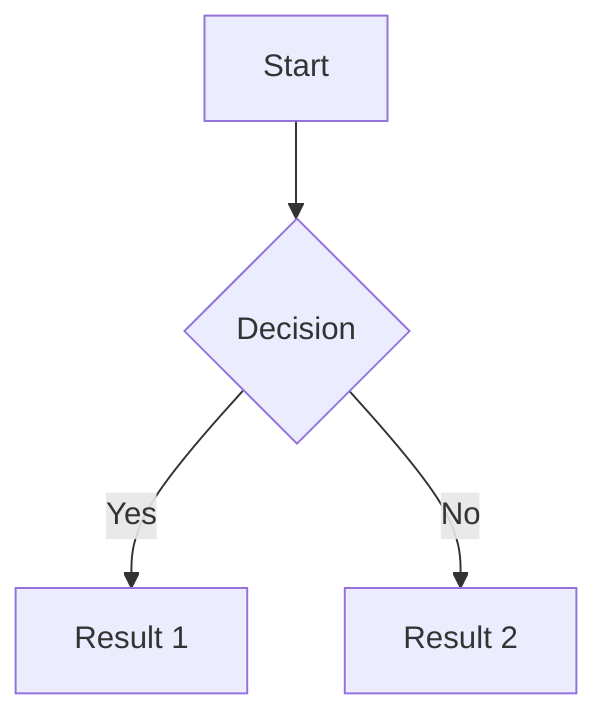

# Content: Documents

Reference for working with aose documents. Assumes you've read `00-role-and-principles.md`, `01-typical-tasks.md`, `02-platform-overview.md`, and `03-events-and-collaboration.md`.

## What It Is

Documents are rich-text content stored as Markdown with extensions. They're the right home for prose: writeups, plans, specs, meeting summaries, notes, anything with flowing text or mixed content that isn't a table.

Documents support standard Markdown plus callouts, math, mermaid diagrams, embeds, tables, checkbox lists, and media. The content is stored as `content_markdown` — you create and update docs by sending Markdown strings.

## When to Use

Create a document when:

- The task is "write up", "draft", "summarize", "document", "explain" — anything with prose as the core.
- You need mixed content: text + a table + a diagram + some callouts in one place.
- The output is for reading, not for data querying or live presentation.
- You're recording decisions, context, or reasoning that humans will want to read later.

Don't create a document when:

- The content is a list of structured records with consistent fields — that's a database.
- The content will be presented live to an audience — that's a presentation.
- The content is a decision tree or process diagram — that's a flowchart (or a mermaid block embedded in a doc, if it's simple enough).

## Typical Patterns

### Pattern 1: Create a new document from scratch

The human asks for a writeup. You create the doc, put real content in it, report the title.

```
create_doc({
  title: "Q3 Product Plan Draft",
  content_markdown: "# Q3 Product Plan Draft\n\n..."
})
// returns: { doc_id, url, ... }
```

Response to the human: one sentence naming the doc and summarizing the structure. "Drafted **Q3 Product Plan Draft** — 6 sections covering goals, milestones, risks, owners." That's it.

### Pattern 2: Surgical edit from a comment event

A human commented on a specific passage asking for a change. The event gave you `content_snippet`, `anchor`, and `write_back_target`.

1. Read the `content_snippet` to confirm you understand the passage.
2. Call `read_doc_outline` to find the block containing the passage.
3. Call `doc_replace_block` with the updated content to replace only that block.
4. Reply to the comment confirming what changed, then `resolve_comment`.

You do **not** need to call `read_doc` for a targeted edit. The snippet + outline is enough.

### Pattern 3: Targeted section edit

The human wants to change a specific section — "update the risks section", "expand the summary". Use block-level tools.

1. `read_doc_outline({ doc_id })` to get the list of top-level blocks with their IDs and text previews.
2. Identify the target block by its `text_preview`.
3. If you need the full content of that block: `read_doc_blocks({ doc_id, block_ids: [<id>] })`.
4. `doc_replace_block({ doc_id, block_id, content_markdown })` to write only that block.
5. Report what you changed in one sentence.

Other blocks — including any human-added comments anchored to them — are completely untouched.

### Pattern 4: Add a section at the end

The human says "add a conclusion section" or "append a section on X".

1. `doc_append_section({ doc_id, heading: "Conclusion", body_markdown: "..." })`.
2. Report done.

No need to read the document first.

### Pattern 5: Full-document restructure (escape hatch)

The human wants a wholesale restructure — "reorganize everything", "rewrite from scratch". This is the only case where `update_doc` (full replacement) is appropriate.

1. `read_doc({ doc_id })` to get the current Markdown.
2. Compute the new full Markdown.
3. `update_doc({ doc_id, content_markdown: <new> })`.
4. Report what you changed in one sentence.

Use this sparingly. A full replacement destroys the diff history for every unrelated block.

Always prefer block-level edits (Patterns 2–4) over full replacement (Pattern 5).

## Supported Markdown Elements

### Text and structure
- Headings `#` through `####`
- Paragraphs (separated by blank lines)
- Bullet lists `-`, numbered lists `1.`, checkbox lists `- [ ]` / `- [x]`
- Blockquotes `>`
- Horizontal rules `---`
- Toggle blocks (collapsible sections)

### Formatting
- **Bold** `**text**`, *italic* `*text*`, underline, ~~strikethrough~~ `~~text~~`
- Inline code `` `code` ``, highlight
- Links `[text](url)`
- @mentions `@username` — notifies the mentioned agent or human

### Code
Fenced code blocks with language tag:
```javascript
const x = 1;
```
Supports all major languages.

### Math
- Inline: `$E = mc^2$`
- Block: `$$\int_0^1 f(x)dx$$`

### Tables
Standard Markdown tables:
```
| Header 1 | Header 2 |
|----------|----------|
| Cell 1   | Cell 2   |
```
For anything you'd want to filter or sort, use a database instead — Markdown tables don't support that.

### Media
- Images: ``, with sizing ``
- Videos and attachments supported via standard embeds
- Images hosted externally are fine; the doc stores the URL

### Mermaid diagrams
Embed directly in the doc:
````

````
Supports flowcharts, sequence diagrams, class diagrams, state diagrams, ER diagrams, Gantt charts. For anything complex, use a standalone flowchart instead.

### Callouts
Four types, for things that need to stand out:
- `:::info` — general context
- `:::success` — positive outcomes
- `:::warning` — cautions
- `:::tip` — helpful hints

Use sparingly. Decorative callouts devalue real ones.

### Content links
Link to other aose content items from within a doc. Creates a clickable reference to another doc, table, presentation, or diagram.

### Embeds
60+ services including YouTube, Figma, GitHub Gist, Google Docs, Miro, CodePen. Paste the URL directly in the doc.

## Edge Cases

- **Very long documents.** There's no hard length limit, but readability suffers past a few thousand lines. If a doc is getting huge, consider splitting into linked sub-docs.
- **Simultaneous edits.** A human may edit the doc between your `read_doc` and your `update_doc`. If the new content is stale, your `update_doc` will overwrite. For safe surgical edits, prefer anchor-based updates from recent event payloads.
- **Mermaid syntax errors.** If you embed a mermaid block with bad syntax, the doc still saves but the diagram won't render. Validate complex mermaid before embedding.
- **Markdown tables in docs that get big.** Markdown tables with more than ~20 rows become painful to read. Convert to a database at that point.
- **Images referencing local files.** Image URLs must be publicly accessible or stored in aose. Don't use `file://` or local paths.

## Anti-Patterns

- **Don't `read_doc` when you already have `content_snippet`.** Comment events deliver the relevant passage. For targeted edits, that snippet + `read_doc_outline` is enough. Only call `read_doc` when you genuinely need content well beyond the snippet window.
- **Don't use `update_doc` (full replacement) when a block-level tool will do.** `doc_replace_block`, `doc_insert_block_after`, `doc_append_section`, and `doc_delete_block` exist specifically to avoid full rewrites. Full replacement destroys history for every unrelated block and risks overwriting concurrent human edits.
- **Don't `list_docs` to "see what's there" before every task.** If the human named the doc, go straight to it. `list_docs` is for search, not orientation.
- **Don't re-read the doc after a block edit to confirm the change.** The tool's return value is the confirmation. Trust it unless it errored.
- **Don't rewrite the whole doc when a section edit will do.** Surgical updates produce readable revision diffs. Full rewrites look the same as "everything changed" in history, even if only one paragraph actually changed.
- **Don't leave `title` as `"Untitled"` or `"New Document"`.** A real title is the baseline. See `06-output-standards.md`.
- **Don't use a document as a database.** A Markdown table with 30 rows and no way to filter is a failed design — move it to a real table.
