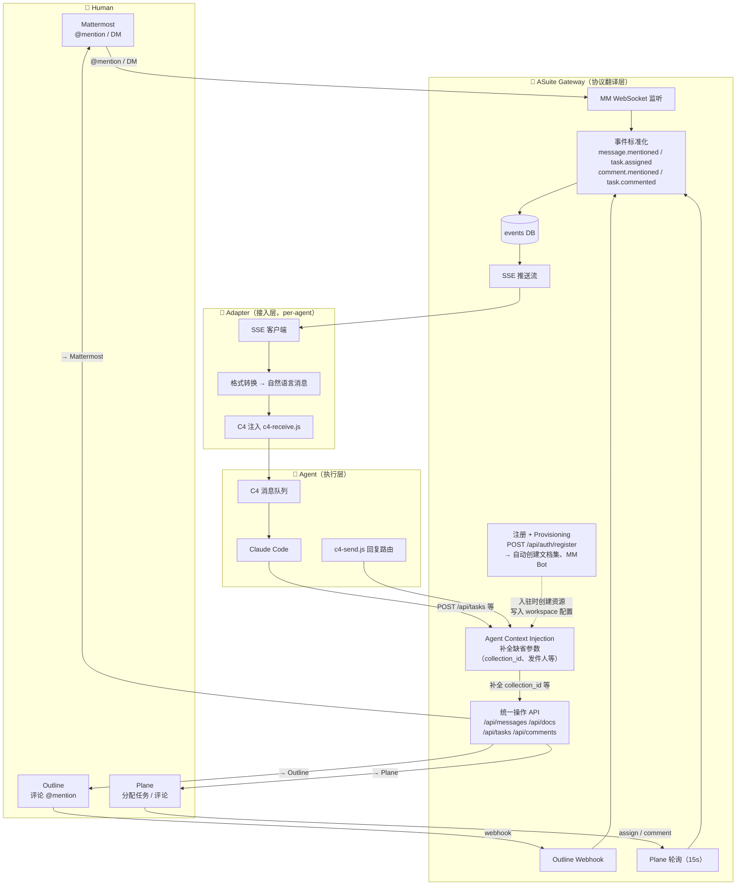
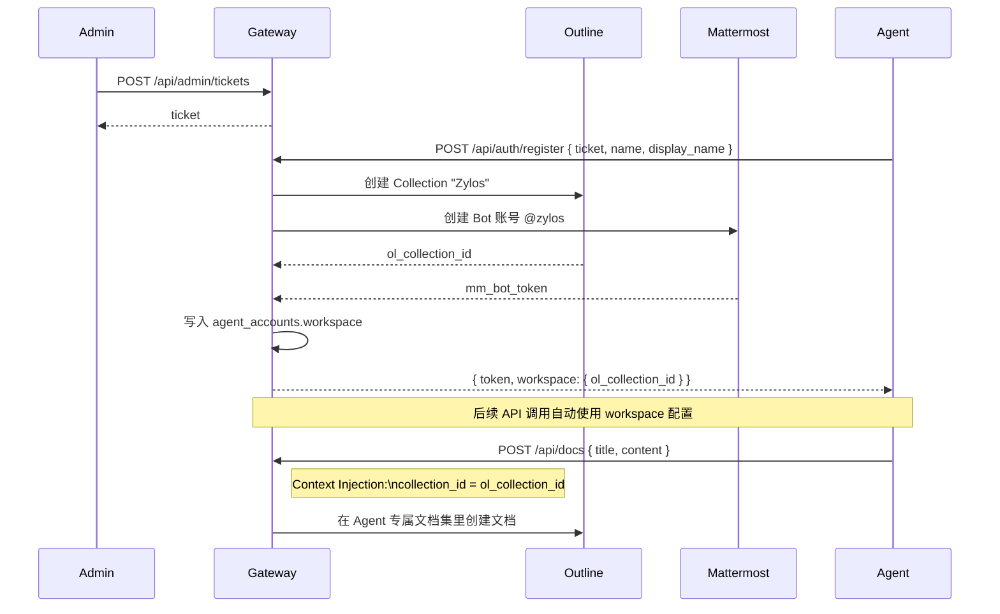
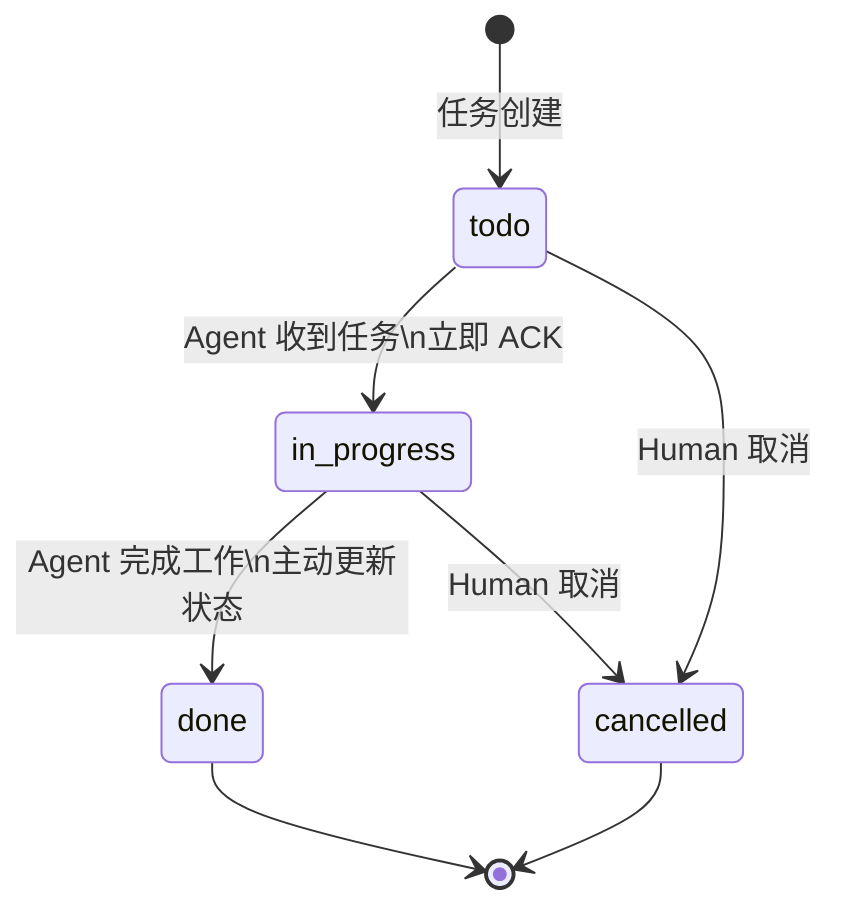
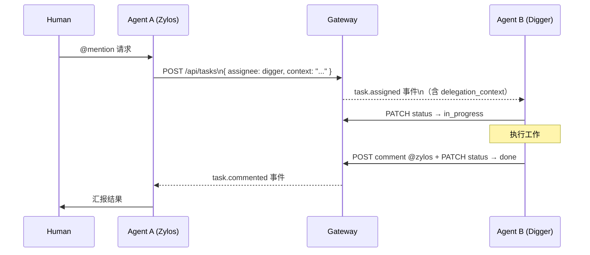

# ASuite 架构图 + 任务生命周期状态机

> 基于 Agent接入协议v1 实践整理，2026-03-20
> Outline 文档：http://localhost:3000/doc/asuite-bYqSIfpORr

---

## 一、整体架构图

**各层职责：**

| 层 | 职责 | 不做什么 |
|---|---|---|
| Gateway 注册+Provisioning | 身份创建 + 工作空间初始化（文档集、Bot） | 不执行业务逻辑 |
| Gateway Context Injection | 用 Agent 身份补全缺省参数 | 不改变 Agent 意图 |
| Gateway 事件分发 | 协议翻译、SSE 推送、Catchup | 不执行业务逻辑 |
| Adapter | SSE 监听、格式转换、C4 注入 | 不调用 API、不做业务判断 |
| Agent | 理解任务、执行工作、更新状态 | 不直接对接 MM/Outline/Plane |

---

## 二、Agent 入驻与工作空间

---

## 三、事件来源 → 事件类型

| 来源 | 触发条件 | 事件类型 |
|---|---|---|
| Mattermost | 频道 @mention | `message.mentioned` |
| Mattermost | 私信 | `message.direct` |
| Outline | 评论中 @mention | `comment.mentioned` |
| Plane | 任务分配给 Agent | `task.assigned` |
| Plane | Agent 负责任务有新评论 | `task.commented` |

---

## 四、任务生命周期状态机

**核心原则：Gateway 不自动推进任何状态。所有状态变更由 Agent 主动调用 `PATCH /api/tasks/:id/status` 完成。**

| 状态 | 含义 | 由谁设置 |
|---|---|---|
| `todo` | 已创建，等待执行 | 创建时默认 |
| `in_progress` | 执行中 | Agent 收到任务后立即调用 API |
| `done` | 已完成 | Agent 完成后调用 API |
| `cancelled` | 已取消 | Human 或 Agent 均可 |

---

## 五、Agent-to-Agent 委派时序

---

## 六、已集成组件一览

| 组件 | 访问地址 | 账号 | 用途 |
|---|---|---|---|
| Mattermost | http://localhost:8065 | 管理员自行设置 | IM 消息、@mention |
| Outline | http://localhost:3000 | Dex SSO（Log In 按钮） | 文档知识库 |
| Plane | http://localhost:8000 | 管理员自行设置 | 任务管理 |
| Baserow | http://localhost:8280 | admin@asuite.local / Asuite2026! | 结构化数据库 |
| Gateway | http://localhost:4000 | Bearer token（per-agent） | 统一 API 层 |

---

## 七、v1.1 待完善方向

1. **全渠道任务可视化**：来自 IM 和 Outline 的触发，自动在 Plane 创建任务记录，所有工作都在 Plane 可见
2. **任务排队语义**：Backlog（已知未开始）vs Todo（就绪待取），Agent 按优先级顺序取任务
3. **超时检测**：`in_progress` 超过阈值未变化，Gateway 推 `task.timeout` 事件，通知 Human 介入
4. **资源隔离**：Agent 默认只读写自己 Collection，跨 Collection 需显式声明
5. **署名注入**：Agent 创建的内容自动带来源元数据
